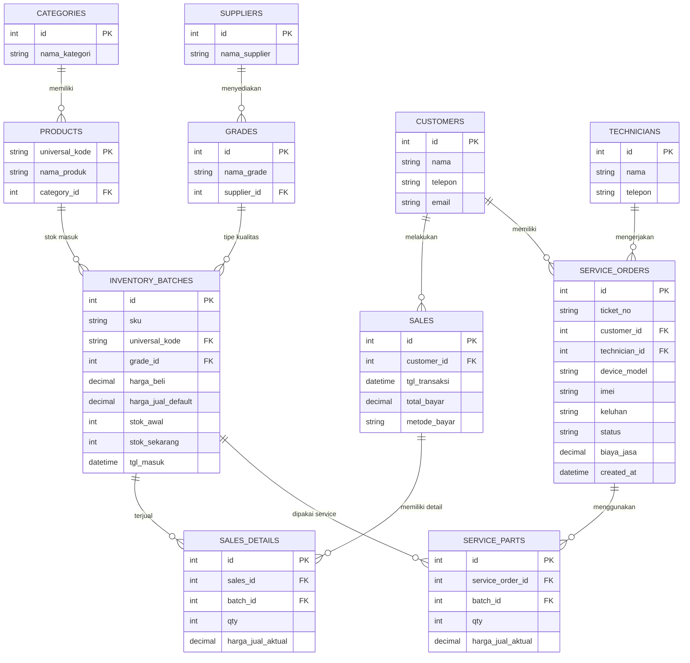
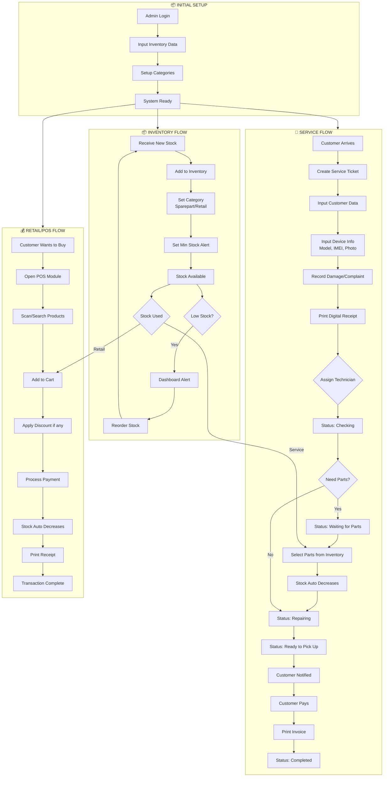
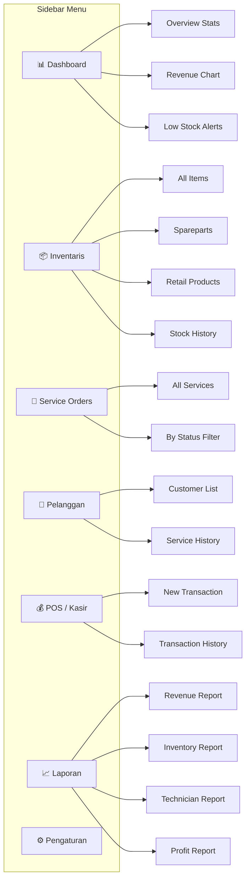
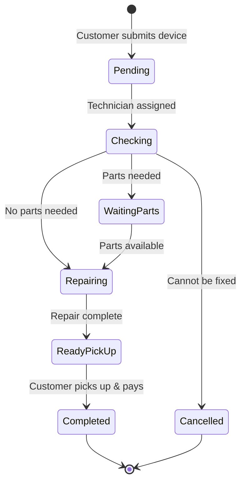
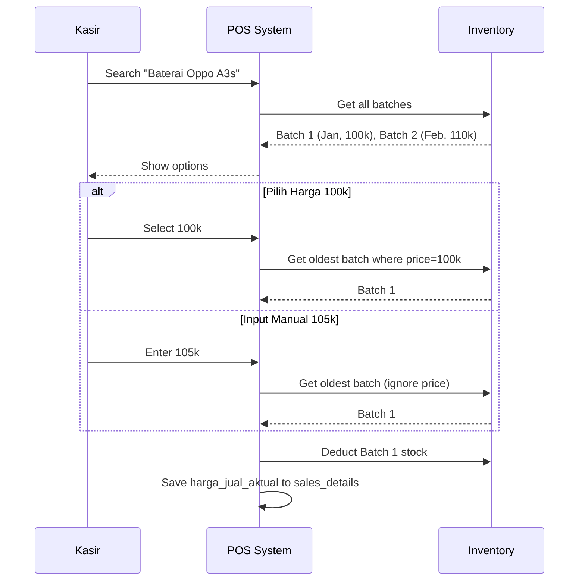
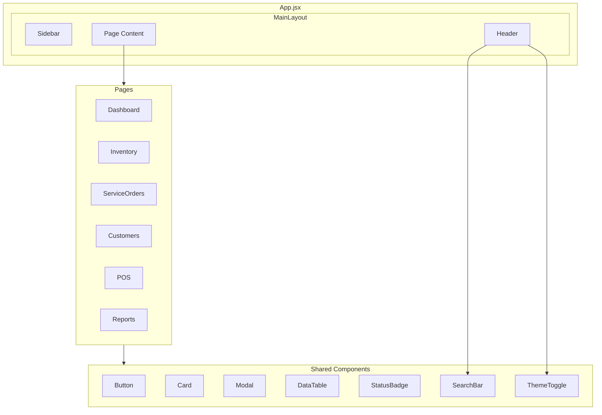

# Phone Service Dashboard - Frontend UI/UX Plan

Dashboard modern untuk manajemen service ponsel dan inventaris dengan sistem FIFO batch.

---

## 🗄️ Database Schema (ERD)



### Penjelasan Tabel

| Tabel | Fungsi |
|-------|--------|
| `categories` | Kategori produk (Baterai, LCD, dll) |
| `suppliers` | Daftar supplier (Braderparts, Zevan, dll) |
| `grades` | Tingkatan kualitas per supplier (Original, Premium, Silver) |
| `products` | Identitas universal produk (1 kode bisa punya banyak batch) |
| `inventory_batches` | **Jantung sistem** - setiap barang masuk = 1 batch baru, FIFO berdasarkan `tgl_masuk` |
| `sales` + `sales_details` | Transaksi penjualan dengan `harga_jual_aktual` per batch |
| `service_orders` + `service_parts` | Order service dan part yang digunakan |

---

## 🔄 Application Flow



---

## 🧭 Navigation Structure



---

## 🔧 Service Status Flow



---

## 💰 POS Batch Selection Logic (FIFO)



---

## 🎨 Design System

### Color Palette
| Token | Dark Mode | Light Mode | Usage |
|-------|-----------|------------|-------|
| `--bg-primary` | `#0f0f1a` | `#f8f9fa` | Main background |
| `--bg-secondary` | `#1a1a2e` | `#ffffff` | Cards, sidebar |
| `--bg-tertiary` | `#16213e` | `#e9ecef` | Elevated surfaces |
| `--accent-blue` | `#4361ee` | `#4361ee` | Primary actions |
| `--accent-green` | `#2ecc71` | `#2ecc71` | Success, completed |
| `--accent-orange` | `#f39c12` | `#f39c12` | Warnings, pending |
| `--accent-red` | `#e74c3c` | `#e74c3c` | Errors, low stock |
| `--text-primary` | `#ffffff` | `#212529` | Main text |
| `--text-secondary` | `#a0a0b0` | `#6c757d` | Muted text |

### Typography
- **Font Family:** Inter (Google Fonts)
- **Headings:** 700 weight, tracking tight
- **Body:** 400-500 weight

### Theme Toggle
- Default: **System preference** (`prefers-color-scheme`)
- Toggle saved to **localStorage**
- CSS variables switch on `[data-theme]`

### Effects
- **Glassmorphism:** `backdrop-filter: blur(10px)` + semi-transparent backgrounds
- **Shadows:** Layered soft shadows for depth
- **Animations:** Smooth 300ms transitions

---

## 🖼️ ASCII Wireframes

### 1. Main Layout Structure

```
┌──────────────────────────────────────────────────────────────────────────────┐
│  HEADER                                                                      │
│  ┌──────────┐  ┌─────────────────────────────────────┐  🔔  👤 Admin ▼      │
│  │ 🔧 Logo  │  │ 🔍 Search...                        │                      │
│  └──────────┘  └─────────────────────────────────────┘                      │
├─────────────┬────────────────────────────────────────────────────────────────┤
│  SIDEBAR    │  MAIN CONTENT AREA                                            │
│             │                                                                │
│  📊 Dash    │                                                                │
│  📦 Invent  │                                                                │
│  🔧 Service │                                                                │
│  👥 Custom  │                                                                │
│  💰 POS     │                                                                │
│  📈 Report  │                                                                │
│             │                                                                │
│  ─────────  │                                                                │
│  ⚙️ Setting │                                                                │
│  🌙/☀️ Theme│                                                                │
└─────────────┴────────────────────────────────────────────────────────────────┘
```

### 2. Dashboard Page

```
┌─────────────────────────────────────────────────────────────────────────────┐
│  📊 Dashboard                                                    [Today ▼] │
├─────────────────────────────────────────────────────────────────────────────┤
│                                                                             │
│  ┌─────────────┐  ┌─────────────┐  ┌─────────────┐  ┌─────────────┐        │
│  │ 🔧 Service  │  │ ✅ Selesai  │  │ ⏳ Pending  │  │ 💰 Omzet    │        │
│  │     12      │  │     45      │  │      8      │  │  Rp 5.2jt   │        │
│  │  In Progress│  │    Today    │  │   Waiting   │  │    Today    │        │
│  └─────────────┘  └─────────────┘  └─────────────┘  └─────────────┘        │
│                                                                             │
│  ┌────────────────────────────────────┐  ┌─────────────────────────────┐   │
│  │ 📈 REVENUE CHART                   │  │ ⚠️ LOW STOCK ALERT          │   │
│  │                                    │  │                             │   │
│  │     ╭──╮                          │  │  LCD iPhone 13      [2] 🔴  │   │
│  │    ╭╯  ╰╮    ╭──╮                 │  │  Baterai S21        [3] 🔴  │   │
│  │   ╭╯    ╰──╮╭╯  ╰╮                │  │  Charger Type-C     [5] 🟡  │   │
│  │  ─╯        ╰╯    ╰──              │  │  [View All →]               │   │
│  │  Sen Sel Rab Kam Jum Sab Min      │  │                             │   │
│  └────────────────────────────────────┘  └─────────────────────────────┘   │
│                                                                             │
│  ┌──────────────────────────────────────────────────────────────────────┐  │
│  │ 🕐 RECENT ACTIVITIES                                                  │  │
│  │  • 14:30 - Service #1234 completed by Andi                           │  │
│  │  • 14:15 - New stock: LCD Samsung A52 (10 pcs)                       │  │
│  │  • 13:45 - Sale: Charger iPhone to Budi - Rp 150.000                 │  │
│  └──────────────────────────────────────────────────────────────────────┘  │
└─────────────────────────────────────────────────────────────────────────────┘
```

### 3. Inventory Page

```
┌─────────────────────────────────────────────────────────────────────────────┐
│  📦 Inventaris                                           [+ Tambah Stok]   │
├─────────────────────────────────────────────────────────────────────────────┤
│  [All] [Spareparts] [Retail]           🔍 Search product...    [Filter ▼] │
│                                                                             │
│  ┌───────────────────────────────────────────────────────────────────────┐ │
│  │ PRODUCT              │ SKU      │ GRADE    │ STOK │ HARGA    │ ACTION │ │
│  ├──────────────────────┼──────────┼──────────┼──────┼──────────┼────────┤ │
│  │ 📱 LCD iPhone 13     │ LCD-IP13 │ Original │  2🔴 │ 850.000  │ [···]  │ │
│  │    └─ Batch #1 (Jan) │          │ Brader   │  2   │ 850.000  │        │ │
│  ├──────────────────────┼──────────┼──────────┼──────┼──────────┼────────┤ │
│  │ 🔋 Baterai Oppo A3s  │ BAT-OPA3 │          │  10  │          │ [···]  │ │
│  │    ├─ Batch #1 (Jan) │          │ Original │  5   │ 100.000  │        │ │
│  │    └─ Batch #2 (Feb) │          │ Premium  │  5   │ 110.000  │        │ │
│  └───────────────────────────────────────────────────────────────────────┘ │
│                                                                             │
│  ┌───────────────────────────────────────────────────────────────────────┐ │
│  │ 📜 STOCK HISTORY                                        [View All →] │ │
│  │  [+] Admin added 10x LCD iPhone 13 @ Rp 850.000           2 hours ago │ │
│  │  [-] Service #1234 used 1x Baterai Samsung S21            3 hours ago │ │
│  └───────────────────────────────────────────────────────────────────────┘ │
└─────────────────────────────────────────────────────────────────────────────┘
```

### 4. Service Orders Page

```
┌─────────────────────────────────────────────────────────────────────────────┐
│  🔧 Service Orders                                       [+ New Service]   │
├─────────────────────────────────────────────────────────────────────────────┤
│  [All] [Pending] [In Progress] [Ready] [Completed]    🔍 Search...         │
│                                                                             │
│  ┌────────────────────────────────────────┬─────────────────────────────┐  │
│  │ SERVICE LIST                           │ DETAIL PANEL                │  │
│  ├────────────────────────────────────────┤                             │  │
│  │ #SV-2024-001      ⏳ Checking         │ Ticket: #SV-2024-001        │  │
│  │ Budi - iPhone 13 Pro                   │ ─────────────────────────── │  │
│  │ LCD Pecah          📅 29 Dec          │ 👤 Budi Santoso             │  │
│  │ Teknisi: Andi                          │    081234567890             │  │
│  ├────────────────────────────────────────│                             │  │
│  │ #SV-2024-002      🔧 Repairing        │ 📱 iPhone 13 Pro            │  │
│  │ Sari - Samsung S21                     │    IMEI: 35467890123456     │  │
│  │ Baterai Drop       📅 28 Dec          │                             │  │
│  │ Teknisi: Beno                          │ 📝 LCD Pecah, tidak bisa    │  │
│  ├────────────────────────────────────────│    touch sama sekali        │  │
│  │ #SV-2024-003      ✅ Ready            │                             │  │
│  │ Ani - Oppo A15 | Ganti Casing         │ 🔧 Parts Used               │  │
│  │                                        │  LCD iPhone 13 x1 - 850k    │  │
│  │                                        │  [+ Add Part]               │  │
│  │                                        │                             │  │
│  │                                        │ STATUS TIMELINE             │  │
│  │                                        │  ● Pending    29 Dec 09:00  │  │
│  │                                        │  ● Checking   29 Dec 10:30  │  │
│  │                                        │  ○ Repairing  -             │  │
│  │                                        │  ○ Ready      -             │  │
│  │                                        │                             │  │
│  │                                        │ [Update Status ▼] [Print]   │  │
│  └────────────────────────────────────────┴─────────────────────────────┘  │
└─────────────────────────────────────────────────────────────────────────────┘
```

### 5. POS / Kasir Page

```
┌─────────────────────────────────────────────────────────────────────────────┐
│  💰 Point of Sale                                                          │
├─────────────────────────────────────────────────────────────────────────────┤
│  ┌─────────────────────────────────────────┬───────────────────────────┐   │
│  │ PRODUCT SEARCH                          │ 🛒 CART                   │   │
│  │ 🔍 Search product name...               │ Customer: [Select... ▼]   │   │
│  │                                         │                           │   │
│  │ ┌─────────────────────────────────────┐ │ ┌───────────────────────┐ │   │
│  │ │ Baterai Oppo A3s                    │ │ │ Baterai Oppo A3s  x1  │ │   │
│  │ │                                     │ │ │ Original - 100.000    │ │   │
│  │ │ Available Batches:                  │ │ │ [−] 1 [+]    [🗑️]    │ │   │
│  │ │ ┌─────────────────────────────────┐ │ │ ├───────────────────────┤ │   │
│  │ │ │ ○ Original (Jan)    Rp 100.000  │ │ │ │ Charger Type-C   x2  │ │   │
│  │ │ │   Stok: 5           [FIFO: 1st] │ │ │ │ Silver - 45.000      │ │   │
│  │ │ ├─────────────────────────────────┤ │ │ │ [−] 2 [+]    [🗑️]    │ │   │
│  │ │ │ ○ Premium (Feb)     Rp 110.000  │ │ │ └───────────────────────┘ │   │
│  │ │ │   Stok: 5           [FIFO: 2nd] │ │ │                           │   │
│  │ │ └─────────────────────────────────┘ │ │ ─────────────────────────  │   │
│  │ │                                     │ │ Subtotal:     Rp 190.000  │   │
│  │ │ Or enter manual price:              │ │ Discount:     [         ] │   │
│  │ │ Rp [___________] [Add to Cart]      │ │ TOTAL:        Rp 190.000  │   │
│  │ └─────────────────────────────────────┘ │                           │   │
│  │                                         │ Payment: [Cash      ▼]    │   │
│  │ 📦 Quick Add Categories:                │                           │   │
│  │ [Baterai] [LCD] [Charger] [Aksesoris]   │ ┌───────────────────────┐ │   │
│  │                                         │ │   💳 BAYAR SEKARANG   │ │   │
│  │                                         │ └───────────────────────┘ │   │
│  └─────────────────────────────────────────┴───────────────────────────┘   │
└─────────────────────────────────────────────────────────────────────────────┘
```

### 6. Customer Page

```
┌─────────────────────────────────────────────────────────────────────────────┐
│  👥 Pelanggan                                            [+ Tambah Baru]   │
├─────────────────────────────────────────────────────────────────────────────┤
│  🔍 Search by name or phone...                                              │
│                                                                             │
│  ┌───────────────────────────────────────┬──────────────────────────────┐  │
│  │ CUSTOMER LIST                         │ DETAIL                       │  │
│  ├───────────────────────────────────────┤ 👤 Budi Santoso              │  │
│  │ 👤 Budi Santoso                       │    📞 081234567890           │  │
│  │    081234567890     5 services        │    ✉️ budi@email.com         │  │
│  ├───────────────────────────────────────│                              │  │
│  │ 👤 Sari Dewi                          │ 📊 Statistics                │  │
│  │    082345678901     3 services        │    Total Services: 5         │  │
│  ├───────────────────────────────────────│    Total Spent: Rp 2.500.000 │  │
│  │ 👤 Ani Kusuma                         │                              │  │
│  │    083456789012     1 service         │ 🕐 Service History           │  │
│  │                                       │ #SV-2024-001 ✅ Completed    │  │
│  │                                       │ iPhone 13 - LCD Pecah        │  │
│  └───────────────────────────────────────┴──────────────────────────────┘  │
└─────────────────────────────────────────────────────────────────────────────┘
```

### 7. Reports Page

```
┌─────────────────────────────────────────────────────────────────────────────┐
│  📈 Laporan                                     [Dec 2024 ▼] [Export CSV]  │
├─────────────────────────────────────────────────────────────────────────────┤
│  [Revenue] [Inventory] [Technician] [Profit]                                │
│                                                                             │
│  ┌─────────────┐  ┌─────────────┐  ┌─────────────┐  ┌─────────────┐        │
│  │ Total       │  │ Service     │  │ Retail      │  │ Profit      │        │
│  │ Rp 25.5jt   │  │ Rp 18.2jt   │  │ Rp 7.3jt    │  │ Rp 8.1jt    │        │
│  └─────────────┘  └─────────────┘  └─────────────┘  └─────────────┘        │
│                                                                             │
│  ┌────────────────────────────────────┐  ┌───────────────────────────────┐ │
│  │ 📊 DAILY REVENUE CHART             │  │ 👨‍🔧 TECHNICIAN PERFORMANCE     │ │
│  │         ╭──╮                       │  │  Andi     ████████████  25    │ │
│  │        ╭╯  ╰╮    ╭──╮             │  │  Beno     ████████      18    │ │
│  │       ╭╯    ╰──╮╭╯  ╰╮            │  │  Citra    █████         12    │ │
│  │      ─╯        ╰╯    ╰──          │  │  Total: 55 services           │ │
│  └────────────────────────────────────┘  └───────────────────────────────┘ │
│                                                                             │
│  ┌───────────────────────────────────────────────────────────────────────┐ │
│  │ 📋 PROFIT PER PRODUCT (harga_jual_aktual - harga_beli)               │ │
│  │  Product            │ Qty Sold │ Revenue    │ Cost      │ Profit     │ │
│  │  LCD iPhone 13      │    8     │ 6.800.000  │ 5.600.000 │ 1.200.000  │ │
│  │  Baterai Samsung    │   15     │ 1.500.000  │ 1.050.000 │   450.000  │ │
│  └───────────────────────────────────────────────────────────────────────┘ │
└─────────────────────────────────────────────────────────────────────────────┘
```

---

## 🏗️ Component Hierarchy




## 📱 Responsive Behavior

| Breakpoint | Behavior |
|------------|----------|
| **Desktop (> 1200px)** | Full sidebar, all panels visible |
| **Tablet (768-1200px)** | Collapsible sidebar, stacked panels |
| **Mobile (< 768px)** | Bottom navigation bar, single column |

---
